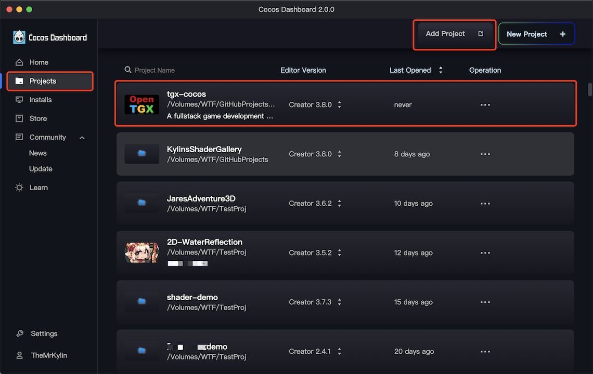

# 快速开始

## 获取 OpenTGX

### 从 Github 获取

使用 Git 工具从 [https://github.com/MrKylinGithub/OpenTGX](https://github.com/MrKylinGithub/OpenTGX) 获取。

### 从 Cocos Store 获取

可以免费从 [https://store.cocos.com/app/en/detail/2787](https://github.com/MrKylinGithub/OpenTGX) 获取。

## 客户端-环境搭建

Cocos 引擎具备双内核（C++内核和Web3D内核）、跨平台、高性能、低功耗等诸多优点，因此 OpenTGX 使用了 Cocos 引擎作为游戏客户端技术支撑。

所有项目案例，均需要安装对应版本的 Cocos Creator 才能打开。

### 1. 安装 Cocos Dashboard

请先前往 [Cocos Creator - 下载页面](https://www.cocos.com/creator-download) 下载 Cocos Dashboard。

### 2. 添加项目



下载完 Cocos Dashboard 后，添加客户端项目（我们以 ` tgx-cocos` 为例）。可以看到它需要的 Cocos Creator 版本号。

### 3. 下载 Cocos Creator


知道需要什么版本的 Cocos Creator 后，我们就可以去安装了。

切换到编辑器标签，我们点击安装按钮，找到对应的版本。点击右边的下载按钮，它下载完成后会自动安装。

### 4. 打开项目

安装完成后，回到项目标签，双击启动项目。 

基于 OpenTGX 的所有项目，都从 start 场景开始。

选择启动场景为 start，点击预览按钮，可以看到它能正常运行起来，就表示我们的客户端环境搭建好了。


> Cocos Creator 使用 TypeScript 进行编程，请自行安装  Visual Studio Code  等工具。请参考 [Cocos 引擎官方文档 - 配置代码编辑环境](https://docs.cocos.com/creator/manual/zh/scripting/coding-setup.html)

## 代码编辑器

很多代码编辑器都支持 TypeScript，但作者的开发环境是 Visual Studio Code，建议大家使用一致的开发工具进行编码。 如果要使用其他代码编辑器，请参考 Visual Studio Code 配置，自行配置相关环境参数。

## 服务器-环境搭建

OpenTGX 是基于 TypeScript 的全栈游戏开发技术方案，服务器是基于 NodeJS + TS 搭建。需要先安装 NodeJS 环境。

> 如果是单机项目，则不需要以下操作

### 1. 安装 NodeJS

1. 在命令行工具中使用 `node -v` 检查是否安装了 NodeJS，如果安装了 NodeJS，请确保在 NodeJS 版本为 15+。

2. 如果没有安装 NodeJS，请前往 [https://nodejs.org](https://nodejs.org/) 下载 LTS 版本。

3. 安装完成后，重新打开命令行，输入 `node -v`，如果输出了 NodeJS 版本号，说明安装成功。

### 2. 初始化项目

OpenTGX 服务器技术由 tsrpc 作为基础支撑。

联机项目会有 xxx-server 和 xxx-client 两个目录。

在安装完 NodeJS 后，进入两个目录，执行 `npm install`，安装 tsrpc 相关依赖项。

### 3. 共享目录

客户端和服务器共享的代码和文件放在 xxx-server/src/shared 目录下，并通过软链或者复制的方法与 xxx-client 共享。

可以在 xxx-server/tsrpc.config.ts 文件下找到对应配置。

```
// Sync shared code
sync: [
    {
        from: 'src/shared',
        to: '../tgx-metaverse-client/assets/module_basic/shared',
        type: 'symlink'     // Change this to 'copy' if your environment not support symlink
    }
],
```

通过 `npm run sync` 可执行以上命名。完成 shared 目录的同步。

> **注意**：
><br>1. 联机项目，请确保 shared 目录同步后，再打开 Cocos Creator。
><br>2. 如果出现 shared 目录识别不正常，可以重启 Cocos Creator。
><br>3. 如果 symlink 方式不支持，请将 symlink 修改为 copy，再执行 `npm run sync`

### 4. 启动进程

配置完成后，进入 xxx-server 目录， 执行 `npm run dev:服务名` 即可启动对应服务。也可以通过 VSCODE 的调试进入。

具体的进程名称和启动方式，请参考对应的项目说明。

> 修改完代码后，按 CTRL + S，会触发自动编译、同步 shared 目录和重启进程。

## 更多文档

内置案例，请查看对应文档。

更多开发文档，请查看：[OpenTGX 开发者文档](./developer-guide.md)。
