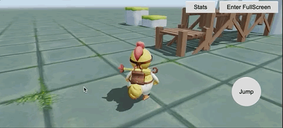
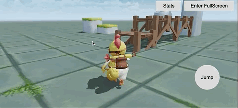
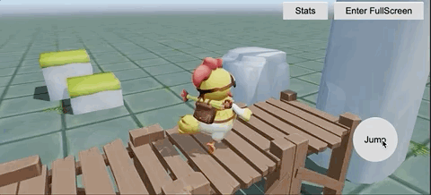

# How to use EasyController 

EasyController can be treated as putting EasyTouch, EasyJoystick, and EasyCamera into one package.

main features are as follows:

- Virtual joystick
- Keyboard and mouse events handler
- Character Controller（move, jump, animate and collide with objects, etc）
- Camera Controller（ThirdPersonCamera,FreeCamera）

## Steps to use

### Add virtual joystick

1. Drag the ui_joystick_panel prefab from the EasyController folder to the Canvas.

2. The green area in the lower-left corner of the virtual joystick is the movement area, when clicked in this area, the movement controller will appear to control the character‘s movement. (When users press the W, A, S and D keys, they can also control the character movement).

3. The purple area is used to control the camera, when click and move in this area, you can operate the camera rotation, when the two fingers press and move, you can adjust the camera observation distance.

4. When pressing the space bar, you can trigger the character's jump function.

### Add CharacterMovement3D

1. Drag the **CharacterMovement3D** component in the EasyController folder to the character object.

2. If the character is to be involved in a physical collision, make sure the character has a **Collider** component and a **RigidBody** component.

3. If the character needs to play animations, please make sure the character node has an animation component.

4. Parameters of CharacterController:

- **velocity** Forward movement speed
- **jumpVelocity** Upward speed at the time of jumping
- **maxJumpTimes** The maximum number of jumps, 0 means can not jump, 1 means can only jump once, N means can jump N times continuously.
- **idleAnimationClip** Animation clip used for idle state
- **moveAnimationClip** Animation clip used for move state
- **jumpBeginAnimationClip** Animation clip used for the jump begin state
- **jumpLoopAnimationClip** Animation clip used for the jump loop state
- **jumpLandAnimationClip** Animation clip used for the jump end state

### ThirdPersonCamera

1. Add the ThirdPersonCamera component to the camera node that needs to be controlled, usually the Main Camera.

2. Parameters of ThirdPersonCamera

- `target`: The target to be followed is usually the character node.
- `lookAtOffset`: Offset of the target position.
- `zoomSensitivity`: Sensitivity when zooming the camera.
- `lenMin`: Minimum observation distance.
- `lenMax`: Maximum observation distance.
- `len`: Default observation distance.
- `rotateVHSeparately`: Whether the horizontal and vertical directions are rotated separately, when turned on, only horizontal or vertical rotation will be performed at the same time.
- `tweenTime`: tween time, Unit: second.

## Programming Guides

1. When the user operates the virtual joystick or presses the keyboard or mouse, the corresponding event will be dispatched, and the event is dispatched by calling the `director.getScene().emit`.

2. List of events

- `EasyControllerEvent.MOVEMENT`: Dispatched when moving
- `EasyControllerEvent.MOVEMENT_STOP`: Dispatched when stop moving
- `EasyControllerEvent.CAMERA_ROTATE`: Dispatched when rotating the camera.
- `EasyControllerEvent.CAMERA_ZOOM`: Dispatched when zooming the camera. 
- `EasyControllerEvent.JUMP`: Dispatched when jumping.
  
1. In your scripts, use `director.getScene().on` to listen to the corresponding events.
