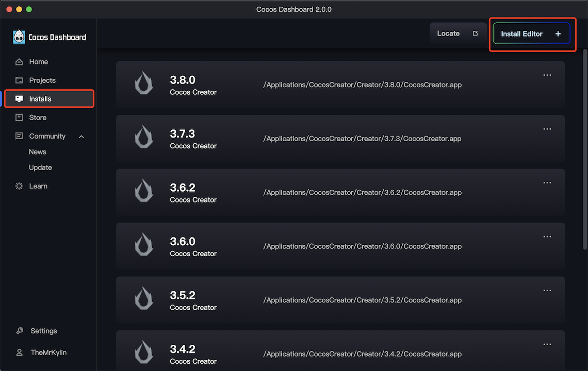
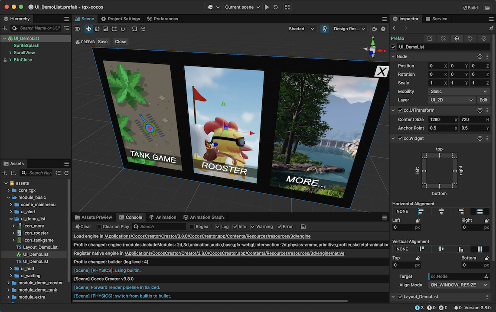
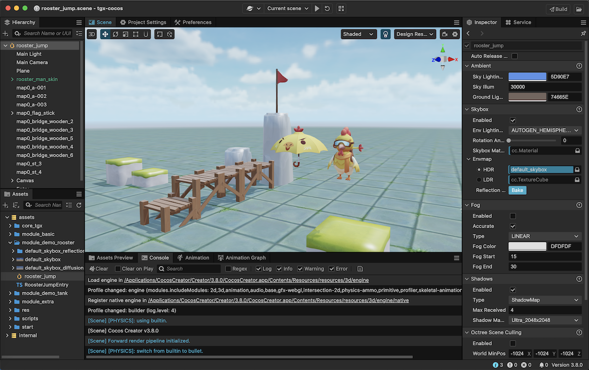

# Quick Start Guide

## Get OpenTGX

### From Github

Use Git tools to clone OpenTGX from [https://github.com/qilinshuyuan/OpenTGX](https://github.com/qilinshuyuan/OpenTGX).

### From Cocos Store

Free to get it from [https://store.cocos.com/app/en/detail/2787](https://github.com/qilinshuyuan/OpenTGX).

## Environment Setup

Cocos Creator has many advantages such as dual-core support (C++ core and Web3D core), cross-platform capabilities, high performance, and low power consumption, which is why OpenTGX uses Cocos Creator as the technical foundation for the game client.

All project examples require the installation of the corresponding version of Cocos Creator to be opened.

### 1. Install Cocos Dashboard

Please proceed to the [Cocos Creator - Download](https://www.cocos.com/creator-download) to download the Cocos Dashboard.

### 2. Add Project

After downloading and installing the Cocos Dashboard, open it and add ` tgx-cocos` to the project list. You can see the required version of the Cocos Creator.

### 3. Install Cocos Creator

After determining which version of Cocos Creator you need, you can proceed with the installation.

Switch to the Editor tab, click the Install button, locate the desired version. Click the Download button to the right, and it will automatically install once the download is complete.

### 4. Open Project

Once the installation is complete, return to the Project tab and double-click to launch the project.

All projects based on OpenTGX start from the "start" scene.

Select "start" as the launch scene, click the Preview button, and if you can see it running properly, it indicates that our client-side environment has been successfully set up.

> Cocos Creator uses TypeScript for scripting and requires the installation of an Integrated Development Environment (IDE) such as Visual Studio Code. Please refer to the [official documentation of the Cocos engine for configuring your code editing environment](https://docs.cocos.com/creator/manual/zh/scripting/coding-setup.html).

## Code Editor

Many code editors support TypeScript, but the author's development environment is Visual Studio Code. It is recommended that everyone uses the same development tool for coding. If you want to use a different code editor, please refer to the configuration of Visual Studio Code and set up the relevant environment parameters on your own.
