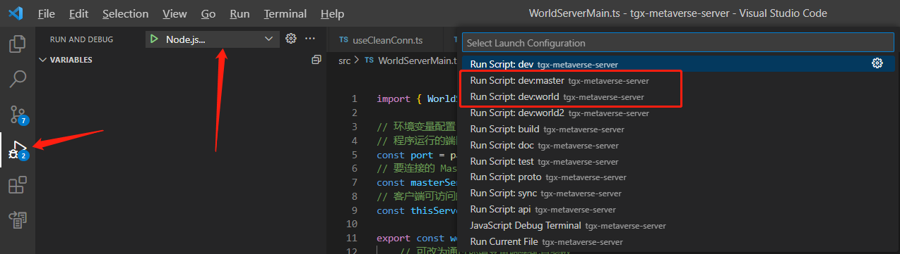

# tgx-metaverse-online

tgx-metaverse-online is a full-stack metaverse template, can be used for online metaverse project developing. It contains the following features:

- With mechanisms such as public sub-world management, private sub-world management, chat systems, and character status synchronization, it can effectively divide the world space and implement project content.
- The front end is based on `tgx-core-cocos`, capable of quickly resolving various issues and publishing across different platforms.
- The backend is based on [tsrpc](https://tsrpc.cn/), a convenient and lightweight NodeJS server framework, refined from numerous project practices.
- It features a multi-process architecture that can be scaled through cluster deployment, making full use of multi-core and multi-machine capabilities.

tgx-metaverse-online uses [Cocos Creator](https://www.cocos.com/) for client side, and uses [TSRPC](https://tsrpc.cn/) for the server side, the programming languages used in both side are unified to TypeScript.

Please refer to the [Quick Start](./quick-start.md) for setting up your development environment.

## Server Setup

`tgx-metaverse-server` contains the source code for the server side. The configuration and startup process is as follows:

1. Locate into `tgx-metaverse-server` directory and open a command console.
2. Run `npm install` to install the necessary dependencies.
3. Run `npm run dev:master` to start the master server process.
4. Open a new command console under the `tgx-metaverse-server` directory.
5. Run `npm run dev:world` to start the world server process.

With the above steps, the server should be successfully launched.

## Client Setup

`tgx-metaverse-client` contains the source code for the client side. The configuration and startup process is as follows:

1. Locate into the `tgx-metaverse-client` directory and open a command console.
2. Run `npm install` to install the necessary dependencies.
3. Launched Cocos DashBoard and add the `tgx-metaverse-client` project.
4. If the required version of Cocos Creator hasn't been installed, please install it first.
5. Double click to open the project.
6. Choose "start.scene" as the startup scene.
7. Click the Preview button to preview the project.

> Please run `npm install` before opening Cocos Creator.
> <br>If the client starts with an error, it is most likely due to the shared directory not taking effect. Please refer to the [Shared Directory](#shared-directory) section.

## Server Debugging

The following steps are showing how to launch the server in debug mode in VSCode to conveniently perform breakpoint debugging.

1. Switch to the debug panel in VSCode
2. Select `Nodejs...`
3. In the pop-up dropdown list, select `dev:master` or `dev:world`
    
4. After selecting the process, click start button to launch the process.


For related commands, please refer to the `scripts` section in `tgx-metaverse-server/package.json`.

## Shared Directory

Some protocols, code, configurations that need to be shared between the server and client sides are placed in the following locations.

- Server Side:`tgx-metaverse-server/src/shared/`
- Client Side:`tgx-metaverse-client/assets/module_basic/shared/`

The shared folder in the client side is either soft-linked or copied from the shared folder in the server side.

It's recommended to use symlink to create soft-linked folder so that both sides can modify the files.

If the content in the shared folder is modified, run `npm run sync` to complete the synchronization.

If you want to modify the client's shared directory location or synchronization method, please go to the sync field in `tgx-metaverse-server/tsrpc.config.ts`.

## Server Side Coding and Compiling

If the server process is running (either in the console or in debug mode), pressing CTRL + S will automatically perform compile, synchronize, and restart the process, which is very convenient.

When programming in this state, there is no need to manually invoke `npm run sync`.

Therefore, for protocol-related code modifications, it is recommended to perform them in the server directory to save a significant amount of synchronization work.

## IP and Port

The port for the `master` process is defined in `src/MasterServerMain.ts`, with the default being 3000.

You can change it here, or modify it during startup by passing in `PORT` followed by the desired port number.

The port for the `world` process is defined in `src/WorldServerMain.ts`.

- `masterServerUrl`：his is the address and port for the lobby server. If there are any changes to the lobby server, this must be updated accordingly.
- `thisServerUrl`：The port for this particular world server.

```ts
const masterServerUrl = process.env['MASTER_SERVER_URL'] || 'http://127.0.0.1:3000';
const thisServerUrl = process.env['THIS_SERVER_URL'] || ('ws://127.0.0.1:' + port);
```

### Local Network Access

If you need to access the service from a local network, such as using a mobile phone for debugging with other devices, then all instances of 127.0.0.1 should be changed to the corresponding IP address of the server host computer.

### Direct Internet Access

In the case of direct internet access, change all references to 127.0.0.1 to 0.0.0.0.

### Nginx Reverse Proxy

If you require a reverse proxy like nginx (which is generally needed for convenience in configuring domain, wss, and https), there is no need to set it to 0.0.0.0. If nginx is on the same machine, keep it as 127.0.0.1. If nginx is not on the same machine, configure it with the local network IP address.

## Server Architecture Overview

### Process Topology Structure

tgx-metaverse consists of two types of processes: master and world.

`master`: The master process is responsible for user data management (login, character creation, etc.) and global features (leaderboards, check-ins, tasks, sub-world entry/exit management, global chat, etc.). Communication between the client and the master process is via HTTP.

`world`: The world management process is responsible for the specific gameplay within the world, such as character data synchronization and interactions within sub-worlds. Communication between the client and the world process is via Websocket. Each world management process is responsible for several independent sub-worlds.

The relationship between master and world is one-to-many because the world process has a heavy workload, and a single world process cannot support many players. Using multiple processes can effectively improve load capacity.

### Communication Flow

#### 1. User Login

When a user logs in, they first communicate with the master process. If the account password is verified, they will receive a token. Subsequent interactions use this token, eliminating the need for account passwords.

#### 2. Not Entering the Metaverse Sub-World

When a user is not in any metaverse sub-world (such as character creation, some special pages), the user will not connect to any world process.

#### 3. Entering the Metaverse Sub-World

When a user wants to enter a metaverse sub-world, they need to first send an entry request to the master process. After receiving the request, the master will query which world process is responsible for the corresponding sub-world based on the subWorldId.

If found, it returns the corresponding login information, which includes the link address for the corresponding sub-world. After obtaining the address, the client connects to the corresponding world process for interaction.

> Note, the data returned by the master to the user for logging into the world process uses MD5 signature verification. For your own project, please quietly modify the `secret key`.

## Sub-World Types

There are two types of sub-worlds: public and private.

- `Public Sub-World`: Automatically created and managed by the server, accessible to all eligible individuals (usually without restrictions), and permanently resides on the server. Similar to the main city and the wilderness maps in a game.
- `Private Sub-World`: Initiated and created by users, accessible only to specific groups of people. Similar to a room in a battle game or a temporarily opened multiplayer instance.

Sub-worlds have two key identifiers:

- `subWorldId`: The instance ID.
- `subWorldConfigId`: The template ID.

Since there is only one instance of a public sub-world, the subWorldId for public sub-worlds directly uses the `subWorldConfigId`. This allows for convenient configuration of transitions and gameplay design.

Each world process can decide which public sub-worlds it is responsible for, and these will be automatically created upon startup. For more details, you can refer to the `publicSubWorldList` in `src/WorldServerMain.ts`.

The capability for each world process to determine which private sub-worlds it is responsible for has not yet been implemented.

## Sub-World Configuration

The Configuration of Sub-Worlds is in `src/shared/SubWorldConfig.ts`

```ts
const _subWorldList = [
    //Public Sub-Worlds
    { id: 'world-001', name: '北京', scene: 'world', isPublic: true, levelData: { prefab: 'levels/level-beijing', bundle: 'module_metaverse' } },
    { id: 'world-002', name: '上海', scene: 'world', isPublic: true, levelData: { prefab: 'levels/level-shanghai', bundle: 'module_metaverse' } },
    { id: 'world-003', name: '成都', scene: 'world', isPublic: true, levelData: { prefab: 'levels/level-chengdu', bundle: 'module_metaverse' } },
    { id: 'world-004', name: '深圳', scene: 'world', isPublic: true, levelData: { prefab: 'levels/level-shenzhen', bundle: 'module_metaverse' } },

    //Private Sub-Worlds，used of instance-based gameplay, such as dungeons or rooms. They can be created and destroyed as needed.
    { id: 'battle-game', name: 'Battle Game', scene: 'world', isPublic: false, levelData: null },
    { id: 'card-game', name: 'Card Game', scene: 'world', isPublic: false, levelData: null },
    { id: 'rpg-game', name: 'RPG Game', scene: 'world', isPublic: false, levelData: null },
];
```

The id refers to the `subWorldConfigId`. It determines the basic information of a sub-world.

- name: The display name.
- scene: The corresponding scene name on the client side.
- isPublic: Whether it is a public sub-world.
- levelData: Level configuration (When each sub-world has its own exclusive scene, there is no need for levelData. When multiple sub-worlds want to share a basic scene, it is necessary to separate the level data from the static scene data. In this case, we would store the level configuration separately as a prefab.)
- bundle: The package from which to load the scene and prefab.

## Database

In this open-source project, to simplify the project setup, file storage has been used directly as a substitute for a database.

For non-high-frequency data access, file storage is actually sufficient; just make sure to back up regularly. A dirty flag can be implemented to write once per frame, reducing disk read and write overhead.

You can also integrate any self-built database or cloud database. Simply replace the specific implementation in `src/UserDB.ts`.

For more information, please refer to the [OpenTGX Developer Documentation - Server Module Documentation]().